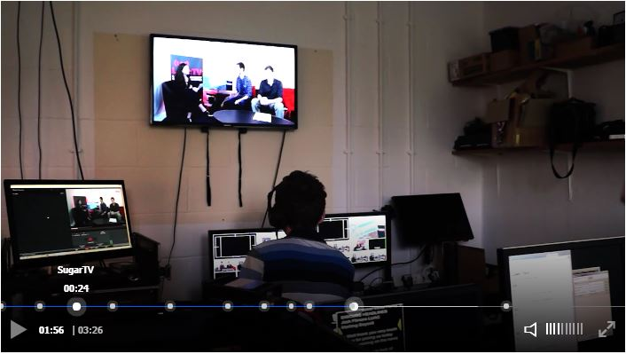

[](https://badge.fury.io/js/clappr-markers-plugin)
# Clappr Markers Plugin
A plugin for clappr which will display markers (and tooltips) at configured points scrub bar.



# Usage
Add both Clappr and the markers plugin scripts to your HTML:

```html
<head>
  <script type="text/javascript" src="http://cdn.clappr.io/latest/clappr.min.js"></script>
  <script type="text/javascript" src="dist/clappr-markers-plugin.js"></script>
</head>
```

You can also find the project on npm: https://www.npmjs.com/package/clappr-markers-plugin

Then just add `ClapprMarkersPlugin` into the list of plugins of your player instance, and the options for the plugin go in the `markersPlugin` property as shown below.

```javascript
var player = new Clappr.Player({
  source: "http://your.video/here.mp4",
  plugins: {
    core: [ClapprMarkersPlugin.default]
  },
  markersPlugin: {
    markers: [
      new ClapprMarkersPlugin.StandardMarker(0, "The beginning!"),
      new ClapprMarkersPlugin.StandardMarker(90, "Something interesting."),
      new ClapprMarkersPlugin.StandardMarker(450, "The conclusion.")
    ],
    tooltipBottomMargin: 17 // optional
  }
});
```

The first paramater to `StandardMarker` is the time in seconds that the marker represents, and the second is the message to be displayed on the tooltip when the user hovers over the marker, and is optional.

The `tooltipBottomMargin` option is optional and specifies the amount of space below tooltips. It defaults to 17.

You can customise both the marker and the tooltip by extending the [`ClapprMarkersPlugin.Marker` class](src/marker.js). Look at the comments in that file for details.

## Updating The Time of a Marker
You can update the time of a marker by calling the `setTime()` method on `StandardMarker`.

## Adding and Removing Markers Programatically
You can add a marker programatically by using the `addMarker()` method. To remove a marker use the `removeMarker()` method and provide the isntance to the `Marker` to remove as the first argument.

# Demo
To run the demo start a web server with the root directory being the root of this repo, and then browse to the "index.html" file in the "demo" folder.

I am also hosting a demo at http://tjenkinson.me/clappr-markers-plugin/

# Development
Install dependencies:

`npm install`

Build:

`npm run build`

Minified version:

`npm run release`
